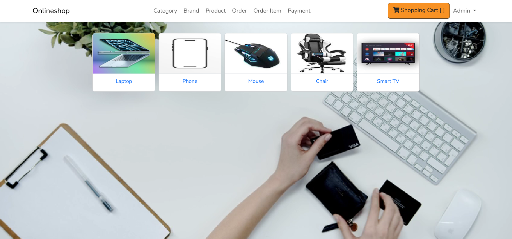

<p align="center">
  
</p>

<h1 align="center">🛒 Online Shopping Website</h1>

<p align="center">
  Built with <strong>Laravel Framework</strong> | Responsive UI | MVC Architecture | Full Stack Web App
</p>

<p align="center">
  <a href="#-live-demo">🔗 Live Demo</a> •
  <a href="#-features">📦 Features</a> •
  <a href="#-screenshots">📸 Screenshots</a> •
  <a href="#-installation-guide">🛠 Installation</a> •
  <a href="#-technologies-used">🧰 Tech Stack</a>
</p>

---

## 🔗 Live Demo

👉 [Click here to view the live site](http://127.0.0.1:8000)  

---

## 📦 Features

- ✅ User registration & login  
- ✅ Secure authentication (Laravel Auth)  
- ✅ Browse & filter products  
- ✅ Add to cart & manage quantities  
- ✅ Simple checkout (no real payment)  
- ✅ Admin panel for product CRUD (Create, Read, Update, Delete)  
- ✅ Responsive design with Bootstrap/Tailwind CSS  
- ✅ Clean MVC code structure  

---

## 📸 Screenshots

| Admin page | User Page |
|------------|-----------|
|  |  |


---

## 🛠 Installation Guide

### 1. Clone the Repository

```bash
git clone https://github.com/Zorom2/online_shopping.git
cd online_shopping
